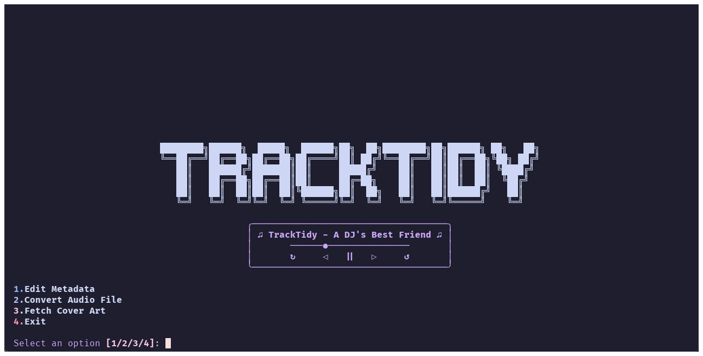

# TrackTidy

TrackTidy is an all-in-one music manager program made for DJs and music enthusiasts who want a lightweight yet powerful way to manage their audio files. The application features a styled command-line interface with robust functionality for managing your music collection.



## Features

TrackTidy currently offers the following features:

- **Metadata Editor**: Edit track metadata including title, artist, album, and genre
- **Audio Conversion**: Convert audio files between different formats (mp3, wav, flac, aac, ogg)
- **Cover Art Fetching**: Search and download album artwork from Spotify and embed it in your MP3 files
- **Batch Processing**: Process multiple files at once for metadata editing and audio conversion

## Planned Features

The following features are planned for future releases:

- **Audio Editing**: Normalize audio, trim tracks, add fades
- **Playlist Generator**: Export selected tracks to `.m3u` or `.pls` format
- **Music Downloader**: Download music from various sources
- **GUI Version**: A graphical user interface alternative

## Requirements

- Python 3.7 or higher
- FFmpeg (for audio conversion - see installation options below)
- Spotify API credentials (for cover art fetching)

## Dependencies

TrackTidy depends on the following Python libraries:

- rich - For the styled command line interface
- mutagen - For audio metadata manipulation
- spotipy - For Spotify API access
- requests - For HTTP requests

## Installation

### Prerequisites

TrackTidy requires:
- Python 3.7 or higher
- FFmpeg (for audio conversion)
- Spotify API credentials (for cover art fetching)

### Standard Installation

1. Clone the repository:
   ```
   git clone https://github.com/yourusername/tracktidy.git
   cd tracktidy
   ```

2. Install the package and dependencies:
   ```
   pip install -e .
   ```

   This will install TrackTidy in development mode with all required dependencies.

### FFmpeg Installation

TrackTidy requires FFmpeg for audio conversion features. You have several options:

1. **Automatic Installation** (Recommended)
   ```
   python tracktidy.py --download-ffmpeg
   ```
   This will download and install FFmpeg directly to the TrackTidy application directory.

2. **Manual System-wide Installation**
   - Windows: Download from [ffmpeg.org](https://ffmpeg.org/download.html) and add to PATH
   - macOS: `brew install ffmpeg`
   - Linux: `sudo apt install ffmpeg` (or use your distro's package manager)

### Spotify API Setup

To use the Cover Art Fetcher feature, you'll need Spotify API credentials:

1. Visit the [Spotify Developer Dashboard](https://developer.spotify.com/dashboard/)
2. Log in with your Spotify account
3. Create a new application
4. Copy the Client ID and Client Secret
5. Enter these credentials when prompted by TrackTidy

The first time you use the Cover Art feature, TrackTidy will prompt you for these credentials.

## Usage

### Running TrackTidy

After installation, you can run TrackTidy with:

```
python tracktidy.py
```

### Metadata Editor

1. Select option 1 from the main menu
2. Enter the path to the audio file
3. View current metadata
4. Enter new values or press Enter to keep current values
5. Metadata will be updated and displayed

### Audio Converter

1. Select option 2 from the main menu
2. Enter the path to the audio file
3. Choose the output format (mp3, wav, flac, aac, ogg)
4. Wait for conversion to complete
5. The converted file will be saved in the same directory

### Cover Art Fetcher (MP3 Only)

1. Select option 3 from the main menu
2. Enter your Spotify API credentials if prompted (only required the first time)
3. Enter the song name and artist
4. Enter the path to the MP3 file
5. Cover art will be downloaded and embedded in the file

### Batch Processing

1. Select option 4 from the main menu
2. Choose between batch metadata editing or batch audio conversion
3. Enter the directory containing the files to process
4. Follow the prompts to apply changes to multiple files at once

This will download and install FFmpeg to the application directory, which is required for audio conversion features.

## Project Structure

```
tracktidy/
│
├── src/                       # Source code directory
│   └── tracktidy/             # Main package
│       ├── core/              # Core functionality
│       ├── services/          # External services
│       ├── batch/             # Batch processing  
│       └── main.py            # Entry point
│   └── bin/                   # FFmpeg installation
│
├── resources/                 # Static resources
│   └── images/                # Images for documentation
│
├── .gitignore                 # Git ignore file
├── LICENSE                    # License file
├── README.md                  # Project README
├── requirements.txt           # Project dependencies
├── setup.py                   # Setup script for package installation
└── tracktidy.py               # Launcher script
```

## Contributing

1. Fork the repository
2. Create your feature branch: `git checkout -b my-new-feature`
3. Commit your changes: `git commit -am 'Add some feature'`
4. Push to the branch: `git push origin my-new-feature`
5. Submit a pull request

## License

This project is licensed under the MIT License - see the LICENSE file for details.
